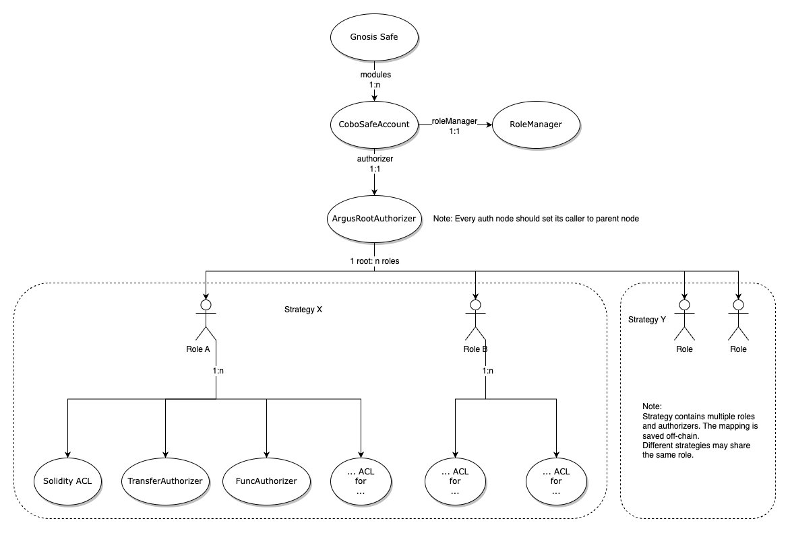

# Cobo Argus

[`Cobo Argus`](https://argus.cobo.com/) is a smart contract-based on-chain digital asset management solution. Using `Cobo Safe` as its functionality layer, `Cobo Argus` implements role-based access controls to help you improve workflow efficiency and enhance internal risk management. The deployment structure of `Cobo Safe` in `Cobo Argus` is as follows:

In `Cobo Argus`, `Cobo Safe Account` is used to manage the access control policies of the `Safe Wallet`. `Cobo Safe Account` uses `ArgusRootAuthorizer` as its `Root Authorizer`. Users can then configure `Roles` and `Sub-Authorizers` based on their business needs:

* Each `Sub-Authorizer` indicates one type of `Permission`.
* If a `Role` is associated with multiple `Sub-Authorizers`, it indicates that this `Role` is associated with a set of `Permissions`.
* Different types of `Roles` can be combined to form an `Authorization Strategy`. This allows the`Delegate` to complete a set of pre-configured investment operations in a DeFi protocol. `Cobo Argus` has integrated a number of `Authorization Strategies` by default.
